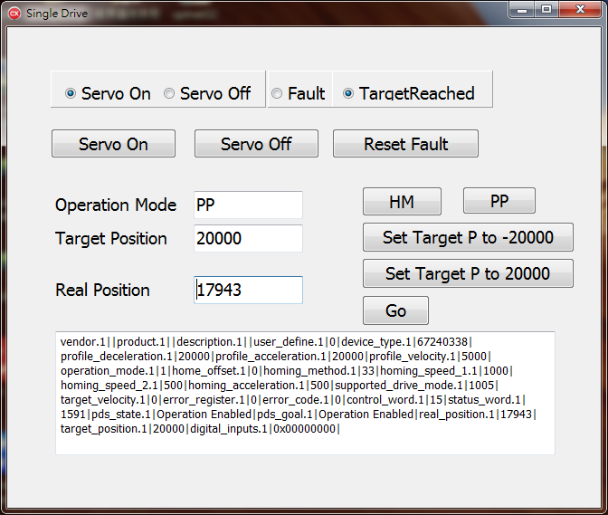

# 前言

botnanabcb 為 C++ Builder 的範例程式，開發工具式採用 Embarcadero® C++Builder 10.2。

# 目錄結構

    botnanabcb
    |-----> SingleDrive
    
* SingleDrive: 一個單軸馬達驅動器的測試範例。

C++ builder 範例需要引用三個檔案 `BotnanaApi.h`、`BotnanaApi.dll` 與 `BotnanaApiBCB.lib`   

**BotnanaApi.h**

可以由在 `botnana-api/botnanacs/BotnanaApi/BotnanaApi` 目錄中取得，放到範例的目錄中。

**BotnanaApi.dll**:

參考 `botnana-api/botnanacs/readme.md` 或是在以下網址取得

* 32 位元 Windows: [https://drive.google.com/drive/u/0/folders/1MAZg9XcLLQ8UlemvOaPnnRXnui_YJEMV](https://drive.google.com/drive/u/0/folders/1MAZg9XcLLQ8UlemvOaPnnRXnui_YJEMV)
* 64 位元 Windows: [https://drive.google.com/drive/u/0/folders/1IZZ1QGJf2xVUvhGGWILW0t5WpiyTczz6](https://drive.google.com/drive/u/0/folders/1IZZ1QGJf2xVUvhGGWILW0t5WpiyTczz6)

此檔案要放到與範例執行檔的同一目錄下，另外則是要用來產生 `BotnanaApiBCB.lib`。

**BotnanaApiBCB.lib**:

利用 C++ Builder 工具 implib 來轉換函式庫格式，其命令如下:

    implib -a BotnanaApiBCB.lib BotnanaApi.dll

產出 `BotnanaApiBCB.lib` 後，要將 `BotnanaApiBCB.lib` 放到範例的目錄中。 

# Single Drive

 

**使用此範例的前提是第一個 EtherCAT 從站必須是馬達驅動器。**

此範例有以下功能:

1. 顯示馬達驅動器的狀態，包含 Drive ON/OFF/Fault。
2. Drive Control，包含 Drive ON/OFF, Reset Fault。
3. 執行 PP 與 HM Mode
4. 顯示 Botnana-Control 回傳訊息。
