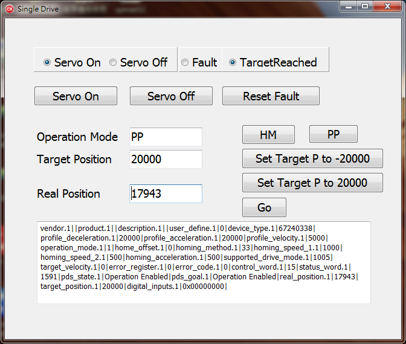

# 前言

botnanabcb 為 C++ Builder 的範例程式，開發工具式採用 Embarcadero® C++Builder 10.2。

# 目錄結構

    botnanabcb
    |-----> SingleDrive
    
* SingleDrive: 一個單軸馬達驅動器的測試範例。

`SingleDrive` 是舊版 Win32 範例，需要引用三個檔案 `BotnanaApi.h`、`BotnanaApi.dll` 與 `BotnanaApiBCB.lib`。目前發佈的 Win64 套件可依以下步驟供新的 C++Builder 專案使用。

**BotnanaApi.h**

可以由在 `botnana-api/botnanacs/BotnanaApi/BotnanaApi` 目錄中取得，放到範例的目錄中。

**BotnanaApi.dll**:

目前的 64 位元 C++Builder 套件可以從 [GitHub Releases](https://github.com/botnana/botnana-apis/releases) 下載 `BotnanaApi-win64.zip`。套件包含 `BotnanaApi_x86_64.dll`、`BotnanaApi.h` 和使用說明。

* 32 位元 Windows 舊版: [https://drive.google.com/drive/u/0/folders/1MAZg9XcLLQ8UlemvOaPnnRXnui_YJEMV](https://drive.google.com/drive/u/0/folders/1MAZg9XcLLQ8UlemvOaPnnRXnui_YJEMV)
* 64 位元 Windows 舊版: [https://drive.google.com/drive/u/0/folders/1IZZ1QGJf2xVUvhGGWILW0t5WpiyTczz6](https://drive.google.com/drive/u/0/folders/1IZZ1QGJf2xVUvhGGWILW0t5WpiyTczz6)

DLL 必須放在與應用程式執行檔相同的目錄，並且用來產生 C++Builder 的匯入函式庫。

**BotnanaApiBCB.lib**:

利用 C++Builder 工具 `implib` 產生對應架構的匯入函式庫。64 位元套件使用:

    implib -a BotnanaApiBCB_x86_64.lib BotnanaApi_x86_64.dll

產出 `BotnanaApiBCB_x86_64.lib` 後，要將它加入 C++Builder 專案。

# Single Drive

 

**使用此範例的前提是第一個 EtherCAT 從站必須是馬達驅動器。**

此範例有以下功能:

1. 顯示馬達驅動器的狀態，包含 Drive ON/OFF/Fault。
2. Drive Control，包含 Drive ON/OFF, Reset Fault。
3. 執行 PP 與 HM Mode
4. 顯示 Botnana-Control 回傳訊息。
