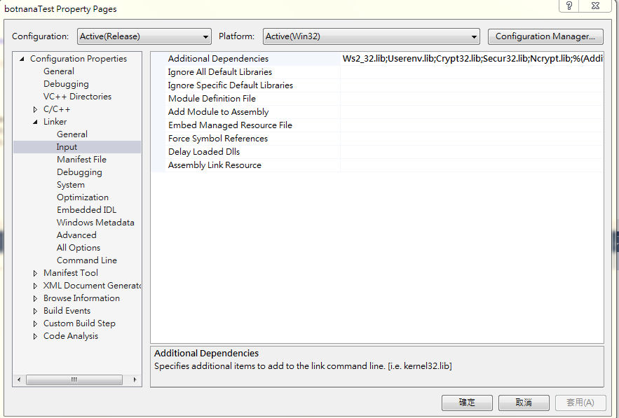

# Botnana C API

## 1. 前言

提供 C 函式庫與 C 語言的範例  

C 語言函式庫下載：

* [V0.3.9](https://github.com/botnana/botnana-apis/releases/tag/v0.3.9)

Release 中的檔案說明如下：

* libbotnana.so: Botnana C API for 32 位元 Linux
* libbotnana_x86_64.so: Botnana C API for 64 位元 Linux

TODO: Windows 及 arm linux 版尚未放上 github。

* 32 位元 Windows: [https://drive.google.com/drive/u/0/folders/1Vmy9aWYeTMhvJDM3W7UwKuqG4SfyA_n7](https://drive.google.com/drive/u/0/folders/1Vmy9aWYeTMhvJDM3W7UwKuqG4SfyA_n7)
* 64 位元 Windows: [https://drive.google.com/drive/u/0/folders/1sGibKjsuhkt0SMJ1w7id1XlOnoYKyD_W](https://drive.google.com/drive/u/0/folders/1sGibKjsuhkt0SMJ1w7id1XlOnoYKyD_W)
* armv7-unknown-linux-gnueabihf: [https://drive.google.com/drive/u/0/folders/1Wi_s20ho5eYl8Ohr5JthpZ1nb6KGw79u](https://drive.google.com/drive/u/0/folders/1Wi_s20ho5eYl8Ohr5JthpZ1nb6KGw79u)

目錄說明：

    botnana-apis
    |-----> botnanac
            |--------> examples          C 語言範例
            |         |----> config_axis.c     運動軸參數設定
            |         |----> config_group.c    軸組參數設定
            |         |----> config_motion.c   運動參數設定
            |         |----> config_slave.c    EtherCAT Slave 參數設定
            |         |----> drive_pp.c        驅動器 PP 模式測試
            |         |----> group1d.c         1D 軸組測試
            |         |----> recorder.c        資料擷取範例 
            |         |----> target_reached.c  測試驅動器 target-reached bit 變化
            |         |----> version.c         取得 Botnana-Control 的版本號碼
            |         |----> words.c           取得所有的 Forth 命令列表  
            |
            |--------> src               C 函式庫原始檔, 以 Rust 語言開發  
                      |----> botnanan.h  C/C++ header file 
                      |----> botnana.rs
                      |----> json_api.rs
                      |----> lib.rs
                      |----> program.rs  


函式庫架構說明：


    +-----------------------------------------------+     +---------------------+
    | +-----------------+        +----------------+ |     |                     |
    | |                 |        |  Botnana-API   | |     |   Botnana-Control   |
    | |  User Program   |function|                | |     |  +--------------+   |
    | | +-------------+ |call    | +-----------+  | |     |  |              |   |
    | | |             +----------> | Tx Thread |  | |JSON-API|              |   |
    | | |             | |        | |           + -+-+-----+---->            |   |
    | | | Main Thread | |        | +-----------+  | |     |  |   WebSocket  |   |
    | | |             | |        | +-----------+  | |     |  |   Server     |   |
    | | |             | |        | | Rx Thread |  | |     |  |              |   |
    | | |             | <--------+ |           | <--+-----+--+-             |   |
    | | +-------------+ |callback| +-----------+  | |  MTConnect            |   |
    | |                 |function| +-----------+  | |     |  |              |   |
    | |                 |        | |Poll Thread|  | |     |  |              |   |
    | |                 |        | |           |  | |     |  |              |   |
    | +-----------------+        | +-----------+  | |     |  |              |   |
    |                            +----------------+ |     |  +--------------+   |
    |      WebSocket Client                         |     |                     |
    |                                               |     |                     |
    +-----------------------------------------------+     +---------------------+

Botnana-API 提供使用者一個包裝好的 WebSocket Client 的函式庫，提供介面讓 user program 送出 Jason API 封包，
利用 callback function 取得 WebSocket Server 回傳的資料。

其包含以下 3 個部份：

1. Tx Thread: 接收 user program 傳送封包的指令,將對應的 Json-API 封包傳送給 Botnana-Control 。
2. Rx Thread: 接收 Botnana-Control 回傳的資料，比對回傳資料內的狀態名稱，呼叫對應的 callback function 。
3. Poll Thread: 定期發送 motion.poll 指令。保持與 Botnana-Controll 的連線，
避免沒有封包傳送時觸發 Botnana-Control Motion server 的 watchdog 的機制。

## 2. 函式列表

### 2.1 與 WebSocket 相關的

#### 2.1.1 `botnana_connect`

用來連結 Botnana-Control Websocket Server。 進行指令傳送或是資料接收前都要先執行此函式。
當連線有問題時則會呼叫函式中所定義的 callback function。

函式原型：

    struct Botnana * botnana_connect(
            const char * address,
            void (* on_ws_error_cb)(const char * str));

參數說明：
    
* `address` : Botnana-Control Server 運行時使用的IP, 一般情況下是 `192.168.7.2`  
* `on_ws_error_cb` : 當 Websocket 連線有問題時，會執行 `on_ws_error_cb` 所定義的 callback function。


回傳值： 

* `struct Botnana *`: 如果連線成功會回傳一結構指標，如果連線失敗則會呼叫 `on_ws_error_cb`。 

範例：

    int main()
    {
        // connect to motion server
        struct Botnana * botnana = botnana_connect("192.168.7.2", on_ws_error_cb);
        .....    
    }

#### 2.1.2 `botnana_send_message`

連線成功後，可以透過 `botnana_send_message` 送出 WebSocket 的資料封包給 Server。

函式原型：

    void botnana_send_message(
            struct Botnana * desc,
            const char * msg);

參數說明：
    
* `desc` : 由函式 `botnana_connect` 取得的回傳指標。
* `msg` : 傳送封包的字串指標。

回傳值： `void`

範例：

    int main()
    {
        // connect to motion server
        struct Botnana * botnana = botnana_connect("192.168.7.2", on_ws_error_cb);
        botnana_send_message(botnana, "Hello World!!");
        .....       
    }


#### 2.1.3 `botnana_set_on_send_cb`

透過此 callback 函式可以取得傳送出去的封包內容。通常用來檢查送出的封包格式是否正確，或是查看封包內容。  

函式原型：

    void botnana_set_on_send_cb(
            struct Botnana * desc,
            void (* cb)(const char * str));

參數說明：
    
* `desc` : 由函式 `botnana_connect` 取得的回傳指標。
* `cb` : WebSocket `on_send` callback function。


回傳值： `void`

範例：

    // Websocket on_send callback function
    void on_send_cb (const char * src)
    {
        printf("on_send: %s\n", src);
    }
    
    int main()
    {
        // connect to motion server
        struct Botnana * botnana = botnana_connect("192.168.7.2", on_ws_error_cb);
        botnana_set_on_send_cb(botnana, on_send_cb);
        .....
    }
    
#### 2.1.4 `botnana_set_on_message_cb`

當接收到 WebSocket Server 傳送過來的資料，可以定義 callback function 取得原始資料內容。 

函式原型：

    void botnana_set_on_message_cb(
            struct Botnana * desc,
            void (* cb)(const char * str));

參數說明：
    
* `desc` : 由函式 `botnana_connect` 取得的回傳指標。
* `cb` : WebSocket `on_message` callback function。


回傳值： `void`

範例：

    // Websocket on_message callback function
    void on_message_cb (const char * src)
    {
        printf("on_message: %s\n", src);
    }

    int main()
    {
        // connect to motion server
        struct Botnana * botnana = botnana_connect("192.168.7.2", on_ws_error_cb);
        botnana_set_on_message_cb(botnana, on_message_cb);
        .....       
    }    


### 2.2 接收 WebSocket Server 的回傳資料

由 WebSocket Server 傳送過來的封包格式如下：

    tag1|value1|tag2|value2|tag3|value3...

#### 2.2.1 `botnana_set_tag_cb`


此函式庫可以檢查 tag 名稱，呼叫 callback function 傳回 value。
使用 `botnana_set_tag_cb` 可以針對 tag 名稱，定義 callback function。

函式原型：

    int32_t botnana_set_tag_cb (
                struct Botnana *    desc,
                const char *        tag,
                uint32_t            count,
                void (* cb)(const char * str));

參數說明：
    
* `desc` : 由函式 `botnana_connect` 取得的回傳指標。
* `tag` : 回傳資料中的 tag 名稱
* `count`: 呼叫 callback function 的次數， 0 表示有收到包含 tag 的資料封包就會呼叫，
大於 0 的值表示收到幾次包含 tag 的資料封包後就不會再呼叫 callback function。 
* `cb` : `on_tag` callback function

回傳值：

* `int32_t` ： -1 表示 `tag` 為空指標。 0 表示正常。

範例：

    int real_position = 0;
    void real_position_cb (const char * src)
    {
        real_position = atoi(src);
    }

    int main()
    {
        // connect to motion server
        struct Botnana * botnana = botnana_connect("192.168.7.2", on_ws_error_cb);
        botnana_set_tag_cb(botnana, "real_position.1.1", 0, real_position_cb);
        .....       
    }       


### 2.3 送給 WebSocket Server 的指令格式

#### 2.3.1 取得 Botnana-control 版本號碼 `version.get`

使用 `version_get` 會送出以下封包：

    {
      "jsonrpc": "2.0",
      "method": "version.get"
    } 

函式原型：

    void version_get(struct Botnana * desc);

參數說明：
    
* `desc` : 由函式 `botnana_connect` 取得的回傳指標。

回傳值： `void`

範例：

    .....    
    int main()
    {
        // connect to motion server
        struct Botnana * botnana = botnana_connect("192.168.7.2", on_ws_error_cb);
        version_get(botnana);
        .....       
    }       

#### 2.3.2 設定 EtherCAT Slave 參數 `config.slave.set`

使用 `config_slave_set` 會送出以下封包：

    {
      "jsonrpc": "2.0",
      "method": "config.slave.set",
      "params": {
        "position": position,
        "channel": channel,
        "param" : value,
      }
    } 

函式原型：

    int32_t config_slave_set(
            struct Botnana * desc,
            uint32_t        position,
            uint32_t        channel,
            const char *    param,
            int32_t         value);

參數說明：
    
* `desc` : 由函式 `botnana_connect` 取得的回傳指標。
* `position` : EtherCAT Slave Position。 1 表示第 1 個 slave。
* `channel` : 在 EtherCAT Slave 上的第 `channel` 個裝置。 表示第 1 個裝置 。
* `param` : 參數名稱。
* `value` : 設定值。 

回傳值：

* `int32_t` ： -1 表示 `param` 為空指標。0 表示正常。

範例：

    // 設定  Slave 1 Channel 1 的參數 homing_speed_1 為 1000
    .....    
    int main()
    {
        // connect to motion server
        struct Botnana * botnana = botnana_connect("192.168.7.2", on_ws_error_cb);
        config_slave_set(botnana, 1, 1, "homing_speed_1", 10000);
        .....       
    }  

#### 2.3.3 取得 EtherCAT Slave 參數 `config.slave.get`

使用 `config_slave_get` 會送出以下封包：

    {
      "jsonrpc": "2.0",
      "method": "config.slave.get",
      "params": {
        "position": position,
        "channel": channel,
      }
    } 

函式原型：

    void config_slave_get(
            struct Botnana * desc,
            uint32_t        position,
            uint32_t        channel);

參數說明：
    
* `desc` : 由函式 `botnana_connect` 取得的回傳指標。
* `position` : EtherCAT Slave Position。 1 表示第 1 個 slave。
* `channel` : 在 EtherCAT Slave 上的第 `channel` 個裝置。 表示第 1 個裝置 。

回傳值： `void`

範例：

    // 取得 Slave 1 Channel 1 的參數
    .....    
    int main()
    {
        // connect to motion server
        struct Botnana * botnana = botnana_connect("192.168.7.2", on_ws_error_cb);
        config_slave_get(botnana, 1, 1);
        .....       
    }  

#### 2.3.4 設定 motion 參數 `config.motion.set`

使用 `config_motion_set` 會送出以下封包：

    {
      "jsonrpc": "2.0",
      "method": "config.motion.set",
      "params": {
        "param" : value
      }
    } 

函式原型：

    int32_t config_motion_set(
            struct Botnana * desc,
            const char *    param,
            int32_t         value);

參數說明：
    
* `desc` : 由函式 `botnana_connect` 取得的回傳指標。
* `param` : 參數名稱。
* `value` : 設定值。 

回傳值：

* `int32_t` ： -1 表示 `param` 為空指標。0 表示正常。

範例：

    // 設定 period_us 參數 為 2000
    .....    
    int main()
    {
        // connect to motion server
        struct Botnana * botnana = botnana_connect("192.168.7.2", on_ws_error_cb);
        config_motion_set(botnana, "period_us", 2000);
        .....       
    }  

#### 2.3.5 取得 motion 參數 `config.motion.get`

使用 `config_motion_get` 會送出以下封包：

    {
      "jsonrpc": "2.0",
      "method": "config.motion.get",
    } 

函式原型：

    void config_motion_get(
            struct Botnana * desc);

參數說明：
    
* `desc` : 由函式 `botnana_connect` 取得的回傳指標。

回傳值： `void`

範例：

    .....    
    int main()
    {
        // connect to motion server
        struct Botnana * botnana = botnana_connect("192.168.7.2", on_ws_error_cb);
        config_motion_get(botnana);
        .....       
    }  

#### 2.3.6 設定 Group 參數 `config.group.set`

使用 `config_group_set_*` 會送出以下封包：

    {
      "jsonrpc": "2.0",
      "method": "config.group.set",
      "params": {
        "position": position,
        "param" : value,
      }
    } 

函式原型：

因為 param 的資料型態有 3 種，所以提供 3 個函式。 

    int32_t config_group_set_string(
            struct Botnana * desc,
            uint32_t position,
            const char * param,
            const char *  value);

    int32_t config_group_set_mapping(
            struct Botnana * desc,
            uint32_t position,
            const char *  value);

    int32_t config_group_set_double(
            struct Botnana * desc,
            uint32_t position,
            const char * param,
            double value);

參數說明：
    
* `desc` : 由函式 `botnana_connect` 取得的回傳指標。
* `position` : Group Index。1 為第 1 個軸組
* `param` : 參數名稱。
* `value` : 設定值。 

回傳值：

* `int32_t` ： -1 表示 `param` 為空指標。0 表示正常。

範例：

    .....    
    int main()
    {
        // connect to motion server
        struct Botnana * botnana = botnana_connect("192.168.7.2", on_ws_error_cb);
        config_group_set_string(botnana, 1, "gtype", "2D");
        config_group_set_double(botnana, 1, "jmax", 80.0);
        config_group_set_mapping(botnana, 1, "3,2");
        .....       
    }  

#### 2.3.7 取得 Group 參數 `config.group.get`

使用 `config_group_get` 會送出以下封包：

    {
      "jsonrpc": "2.0",
      "method": "config.group.get",
      "params": {
        "position" : position
      }
    } 

函式原型：

    void config_group_get(
            struct Botnana * desc
            uint32_t        position);

參數說明：
    
* `desc` : 由函式 `botnana_connect` 取得的回傳指標。
* `position` : Group Index。1 為第 1 個軸組

回傳值： `void`

範例：

    .....    
    int main()
    {
        // connect to motion server
        struct Botnana * botnana = botnana_connect("192.168.7.2", on_ws_error_cb);
        config_group_get(botnana, 1);
        .....       
    }  

#### 2.3.8 設定 Axis 參數 `config.axis.set`

使用 `config_axis_set_*` 會送出以下封包：

    {
      "jsonrpc": "2.0",
      "method": "config.axis.set",
      "params": {
        "position": position,
        "param" : value,
      }
    } 

函式原型：

因為 param 的資料型態有 3 種，所以提供 3 個函式。 

    int32_t config_axis_set_string(
            struct Botnana * desc,
            uint32_t position,
            const char * param,
            const char * value);

    int32_t config_axis_set_integer(
            struct Botnana * desc,
            uint32_t position,
            const char * param,
            int32_t  value);

    int32_t config_axis_set_double(
            struct Botnana * desc,
            uint32_t position,
            const char * param,
            double value);

參數說明：
    
* `desc` : 由函式 `botnana_connect` 取得的回傳指標。
* `position` : Axis Index。1 為第 1 個運動軸。
* `param` : 參數名稱。
* `value` : 設定值。 

回傳值：

* `int32_t` ： -1 表示 `param` 為空指標。0 表示正常。

範例：

    .....    
    int main()
    {
        // connect to motion server
        struct Botnana * botnana = botnana_connect("192.168.7.2", on_ws_error_cb);
        config_axis_set_string(botnana, 1, "name","A1");
        config_axis_set_double(botnana, 1, "home_offset" ,0.5);
        config_axis_set_integer(botnana, 1, "encoder_direction",-1);
        .....       
    }  

#### 2.3.9 取得 Axis 參數 `config.axis.get`

使用 `config_axis_get` 會送出以下封包：

    {
      "jsonrpc": "2.0",
      "method": "config.axis.get",
      "params": {
        "position" : position
      }
    } 

函式原型：

    void config_axis_get(
            struct Botnana * desc
            uint32_t        position);

參數說明：
    
* `desc` : 由函式 `botnana_connect` 取得的回傳指標。
* `position` : Axis Index。1 為第 1 個運動軸。

回傳值： `void`

範例：

    .....    
    int main()
    {
        // connect to motion server
        struct Botnana * botnana = botnana_connect("192.168.7.2", on_ws_error_cb);
        config_group_get(botnana, 1);
        .....       
    }  


#### 2.3.10  儲存參數檔 `config.save`

使用 `config_save` 會送出以下封包：

    {
      "jsonrpc": "2.0",
      "method": "config.save",
    } 

函式原型：

    void config_save(struct Botnana * desc);

參數說明：
    
* `desc` : 由函式 `botnana_connect` 取得的回傳指標。

回傳值： `void`

範例：

    .....    
    int main()
    {
        // connect to motion server
        struct Botnana * botnana = botnana_connect("192.168.7.2", on_ws_error_cb);
        config_save(botnana);
        .....       
    }  

#### 2.3.11 背景程式執行 

使用背景程式執行主要是

1. 當自定義的 real time script 較大，直接編譯可能會造成 Real Time Cycl Overrun, 
2. 當 real time script 中有等待指令時，則必須要完成等待命令後才會在接收新的 real time script。
  

可以使用的函式有：

```
    // 建立新的 program
    struct Program * program_new (const char * name);
    
    // 將 cmd 放到 program 內 
    void program_line(struct Program * pm, const char * cmd);
    
    // 清除 program 的內容
    void program_clear(struct Program * pm);
    
    // 將程式送到 botnana-control, 並以背景執行的方式進行編譯，
    // 完成後會傳回 deployed|ok 的訊息
    void program_deploy(struct Botnana * desc, struct Program * pm);
    
    // 將程式以背景執行的方式執行，當執行完成後會送出  end-of-program|ok 的訊息
    // 此時是取得程式名稱,通知 botnana-control 以背景執行該指令 
    void program_run(struct Botnana * desc, struct Program * pm);
    
    // 停止目前在背景執行的工作 
    void botnana_abort_program (struct Botnana * desc);
```

範例：

```
    struct Botnana * botnana = botnana_connect("192.168.7.2", on_ws_error_cb);
    botnana_set_tag_cb(botnana, "end-of-program", 0, end_of_program);
    botnana_set_tag_cb(botnana, "deployed", 0, deployed_cb);    
    
    // new program
    struct Program * pm = program_new("drive-pp");

    // 開始編寫程式內容
    
    // reset drive 1 fault
    program_line(pm, "1 1 reset-fault");
    // wait drive 1 to no fault
    program_line(pm, "1 1 until-no-fault");
    // drive 1 servo on
    program_line(pm, "1 1 servo-on");
    // wait drive 1 to servo on
    program_line(pm, "1 1 until-servo-on");
        
    // 將程式送到 botnana-control, 以背景執行方式進行編譯
    program_deploy(botnana,pm);
    
    // 等待 deployed|ok 訊息
        
    // 以背景執行方式執行
    program_run(botnana, pm);
    
    // 等待 end-of-program|ok 訊息
```

#### 2.3.12 訂閱及退訂從站資訊

使用 `ec_slave_subscribe` 可以訂閱從站的資訊，而 `ec_slave_unsubscribe` 則可以取消訂閱。
當訂閱從站資訊，websocket server 會每 20ms 向 motion control 要被訂閱的從站的資訊。當從站
的狀態有變化時，這些變化的資訊會透過 websocket server 回傳。

處理從站資訊的方法則請見 2.2 節的說明。

使用`ec_slave_subscribe` 和 `ec_slave_unsubscribe` 的好處是不必一直透過 2.1.2 節的 `botnana_send_message`
函數送出 `.slave` 或是 `.slave-diff` 等要求從站訊息的指令，減少了封包數量。

函式原型：

```
    void subscribe_ec_slave(struct Botnana * desc, uint32_t alias, uint32_t position);
    void unsubscribe_ec_slave(struct Botnana * desc, uint32_t alias, uint32_t position);
```

參數說明：
    
* `desc` : 由函式 `botnana_connect` 取得的回傳指標。
* `alias` : 從站別名。
* `position` : 從站位置。當從站別名為 0 時，位置是從主站算起的位置。主站算起的第一個從站的位置是 1。當從站別名不為 0 時，是從別名指定的從站算起的位置。

回傳值： `void`

範例：

    int main()
    {
        // connect to motion server
        struct Botnana * botnana = botnana_connect("192.168.7.2", on_ws_error_cb);
        subscribe_ec_slave(botnana, 0, 1);
        .....       
        unsubscribe_ec_slave(botnana, 0, 1);
        .....       
    }

比較簡單的應用可以不必 `unsubscribe_ec_slave`。如果 websocket 結束連線會自動執行退訂。

## 3. 產生函式庫方法：

此 C 語言函式庫是由 Rust 進行開發，如果有自行修改的需求請安裝 Rust 開發工具。

請參考 [The Rust Programming Language](https://www.rust-lang.org/)  https://www.rust-lang.org/

安裝好 Rust 開發工具後，執行 `cargo build --release` 指令就可以編譯出 `botnana.lib` 


## 4. C++ 使用者
 
如果是以 C++ 呼叫 C 語言的函式庫，因為 C++ 有名稱修飾(Name Mangling) 而 C 沒有，在函式庫已經有處理，所以可以直接引用。

如果是 VC++ 要使用此函式庫，需要連結以下函式庫：
 
 * Ws2_32.lib
 * Userenv.lib


從 VC++ 主選單選擇 Project -> Properties 後會跳出一個視窗，如下圖。 在 Linker -> input 中的 Additional Dependencies 
加入以上的函式庫即可。

 
 
 
 
