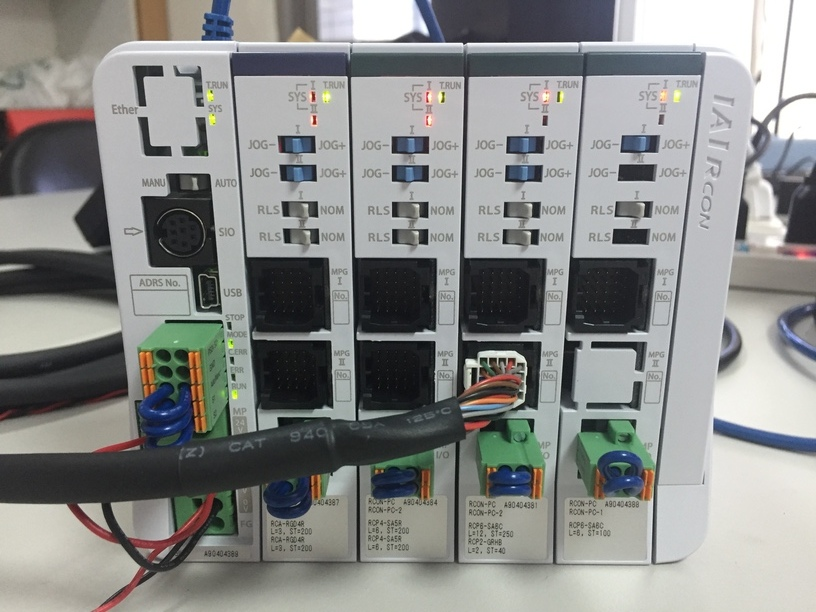
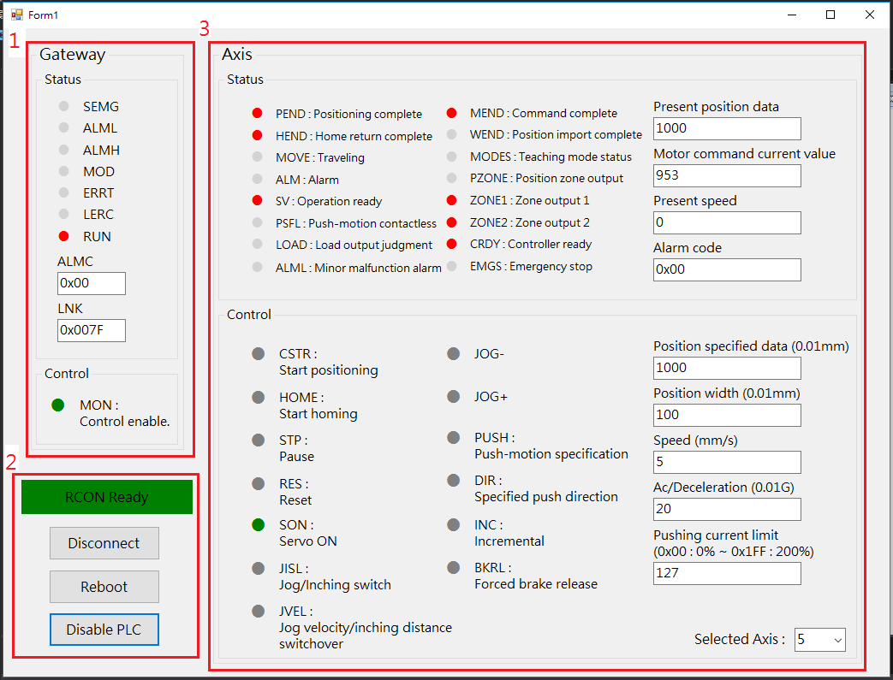

# IAI RCON SYSTEM

### 測試從站

IAI RCON-GW-EC + RCON-AC/PC  

### 測試畫面

1. Gateway 狀態/控制介面，點擊 Control 區塊中的圓形圖示可以開啟/關閉對應的 Control Bit。
2. 應用程式控制介面，三個按鈕分別控制: WebSocket 連線/中斷連線、Botnana 重新啟動、範例 PLC 啟動/關閉。
3. Axis 狀態/控制介面，可以於 Control 區塊中切換控制軸、寫入控制參數和操作對應的 Control Bit。

### 範例 PLC

本範附有一個簡單的 PLC (參考 plc.fs)，進行 home, start, pause, reset 相關的 status/constorl bit 監控 (參考 RCON system 手冊 3.8 I/O signals)。  
可以點擊 Enable PLC 按鍵啟動，或是點擊 Disable PLC 關閉，方便手動/PLC 交叉測試。

### 注意事項

1. 若執行後停在 Connection Not Ready，請檢查 PC 與 Botnana 連線。
2. 若執行後停在 SFC Not Ready，請檢查載入的 Forth scripts 是否有語法錯誤。
3. 若執行後停在 RCON Not Ready，請檢查 RCON system 是否正確連接，且 RCON system 需為第一個 slave 或 station alias = 10。
4. 本範例默認所有軸皆設置為 Direct Numerical control mode (請參考 RCON system 手冊 3.7 Address Configuration)。若不是該配置，Gateway input/output domain 的內容會不同，需要另外實作。