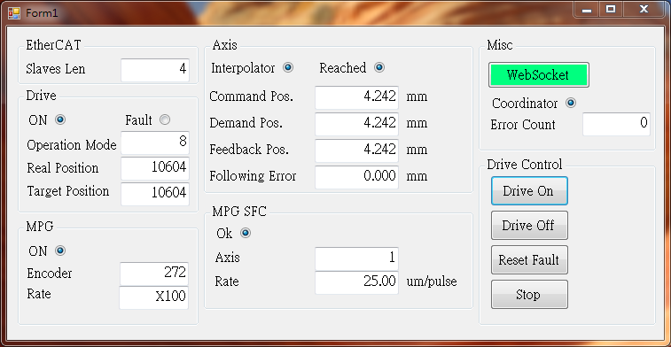

# 手輪 Manual Pulse Generator

手輪： HONTKO Pendant Hand-held HPG-A1-P6M-AL-S3

範例畫面：

EtherCAT從站配接清單：

| Slave Position | Item | 說明 |
|----------------|------|-----|
| 1 | Delta A2-E  | 馬達驅動器 |
| 2 | Delta R1-EC5500 | EtherCAT Coupler |
| 3 | Delta R1-EC5621 | 接收手輪編碼器訊號 |
| 4 | Delta R1-EC6022 | 數位輸入訊號模組，接收軸與倍率訊號 |

