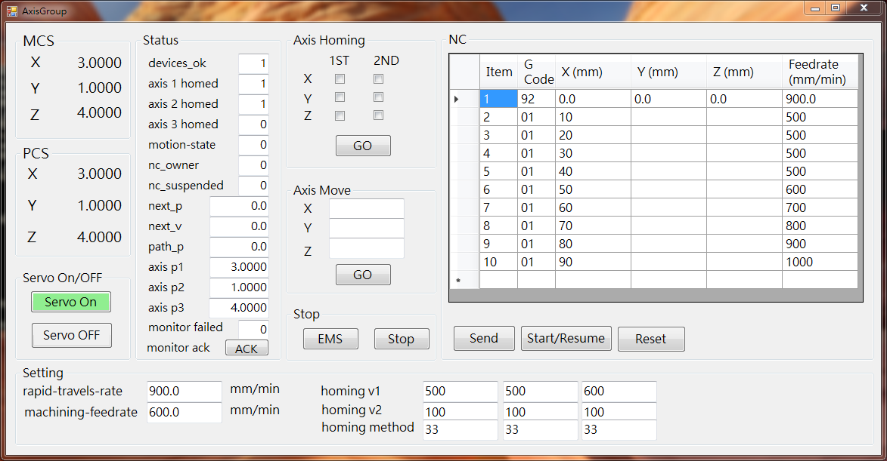

# 前言

botnanacs 為 C# 的範例程式，開發工具式採用 Microsoft Visual Studio Community 2017。

# 目錄結構

    botnanacs
    |-----> AxisGroup
    |-----> BotnanaApi 
    |-----> SingleDrive
    |-----> TouchProbe

* AxisGroup: 此範例結合 SFC 與 3D 運動軸組，可以作為 3 軸運動平台的基礎，包含回歸機械原點，軸移動，NC 程式運作。
* BotnanaApi: 將 C 語言函式庫 `botnana.lib` 轉換為 C# 使用的動態連結檔 `BotnanaApi.dll` 。
* SingleDrive: 一個單軸馬達驅動器的測試範例。
* TouchProbe: 馬達驅動器 Touch Probe Function 的測試範例。

---

# Axis Group (3D)

**使用此範例的前提是第一個 Axis Group 必須 3D 軸組。如果沒有馬達驅動器也可以執行此範例，
只要是對應的運動軸為虛擬軸就可以。**

此範例有以下功能:

1. MCS，PCS: 機械座標與工件座標資訊
2. Servo ON/OFF: 結合 Servo On/OFF SFC，控制馬達驅動器 ON/OFF，具備落後誤差檢查的功能。
3. Axis Homing: 結合運動軸回歸機械原點 SFC，可以分為兩個優先順序進行回歸機械原點。
4. Axis Move: 以機械座標為準的運動軸移動功能。
5. Stop: 執行緊急停止或是一般運動停止的功能。
6. NC: 使用表格填寫 NC 程式，執行 NC 程式。
5. Setting: 調整 SFC 參數的介面。

此範例使用的 SFC 共計為:
1. config.sfc : 變數宣告。
3. homing.sfc : 運動軸回歸機械原點 SFC。
4. motion_state.sfc : 將運動模式分為 Homing, Jogging, Machining。
2. servo_on_off.sfc : Servo On/OFF SFC。
5. manager.sfc : 整合 SFC 。

config.sfc 必須要第一個載入，manager.sfc 必須是最後載入，其它則是沒有先後順序關係。

以上 SFC 放在 `botnanacs/AxisGroup/AxisGroup` 目錄。 SFC 的說明可以參考 [https://botnana.github.io/botnana-book/sfc.html](https://botnana.github.io/botnana-book/sfc.html)

編譯與執行此專案需要 `BotnanaApi.dll`， 可以由以下連結位置取得，或是參考 Botnana APi 章節自行產生。

* 32 位元 Windows: [https://drive.google.com/drive/u/0/folders/1MAZg9XcLLQ8UlemvOaPnnRXnui_YJEMV](https://drive.google.com/drive/u/0/folders/1MAZg9XcLLQ8UlemvOaPnnRXnui_YJEMV)
* 64 位元 Windows: [https://drive.google.com/drive/u/0/folders/1IZZ1QGJf2xVUvhGGWILW0t5WpiyTczz6](https://drive.google.com/drive/u/0/folders/1IZZ1QGJf2xVUvhGGWILW0t5WpiyTczz6)

將 `BotnanaApi.dll` 放到 `botnanacs/AxisGroup/AxisGroup` 目錄下就可以編譯與執行該範例。

# Botnana API
  
編譯 BotnanaAPI 專案需要 C 語言標頭擋 `botnana.h` 與靜態連結檔 `botnana.lib`。 `botnana.h` 在 `botnana-api/botnanac/src` 中取得。 `botnana.lib` 可以由以下連結位置取得，或是參考 `botnana-api/botnanac/readme.md` 文件自行產生。

* 32 位元 Windows: [https://drive.google.com/drive/u/0/folders/1Vmy9aWYeTMhvJDM3W7UwKuqG4SfyA_n7](https://drive.google.com/drive/u/0/folders/1Vmy9aWYeTMhvJDM3W7UwKuqG4SfyA_n7)
* 64 位元 Windows: [https://drive.google.com/drive/u/0/folders/1sGibKjsuhkt0SMJ1w7id1XlOnoYKyD_W](https://drive.google.com/drive/u/0/folders/1sGibKjsuhkt0SMJ1w7id1XlOnoYKyD_W)

將 `botnana.h` 與 `botnana.lib` 放到 `botnanacs/BotnanaApi/BotnanaApi` 目錄下就可以成功編譯出 `BotnanaApi.dll`。`BotnanaApi.dll` 的目錄位置依編譯的組態設定，通常會在以下的目錄位置:

* `botnanacs/BotnanaApi/Release`
* `botnanacs/BotnanaApi/Debug`
* `botnanacs/BotnanaApi/x64/Release`
* `botnanacs/BotnanaApi/x64/Debug`

BotnanaAPI 專案還需要 `Ws2_32.lib` 與 `Userenv.lib` 函式庫，在此專案的設定檔中已將這兩個函式庫的連結設置完成，如果有自行轉換函式庫的需求，要增加這兩個函式庫的連結設定，設定的方式可以參考 `botnanac/readme.md`。

---

# Single Drive

 

**使用此範例的前提是第一個 EtherCAT 從站必須是馬達驅動器。**

此範例有以下功能:

1. 顯示目前連線的 EtherCAT 從站的連線數。
2. 顯示馬達驅動器的狀態，包含 Drive ON/OFF/Fault, ORG, NEG/POS Limit, Operation Mode, Position 資訊。
3. Drive Control，包含 Drive ON/OFF, Reset Fault。
4. Drive P2P，在驅動器的 PP 模式下進行單點運動。
5. Real Time Program P2P，在驅動器的 PP 模式搭配程式背景執行的功能，進行 3 個目標點的連續運動。 

此範例對於多數的驅動器都是適用。目前遇到比較的的是特別的是:

1. MITSUBISHI MR-J4-10TM : 需要修改驅動器參數才可以使用 PP Mode。
2. OMRON R88D-1SN04H-ECT : 其 PP Mode 只可以設定為 `Change set immediately`，所以在切換到 PP Mode 要另外下 `+pp-imt ( drive-channel slave-position -- )` 指令。

編譯與執行此專案需要 `BotnanaApi.dll`， 可以由以下連結位置取得，或是參考 Botnana APi 章節自行產生。

* 32 位元 Windows: [https://drive.google.com/drive/u/0/folders/1MAZg9XcLLQ8UlemvOaPnnRXnui_YJEMV](https://drive.google.com/drive/u/0/folders/1MAZg9XcLLQ8UlemvOaPnnRXnui_YJEMV)
* 64 位元 Windows: [https://drive.google.com/drive/u/0/folders/1IZZ1QGJf2xVUvhGGWILW0t5WpiyTczz6](https://drive.google.com/drive/u/0/folders/1IZZ1QGJf2xVUvhGGWILW0t5WpiyTczz6)

將 `BotnanaApi.dll` 放到 `botnanacs/SingleDrive/SingleDrive` 目錄下就可以編譯與執行該範例。

---

# Touch Probe

此範例用來測試馬達驅動器 Touch Probe 的功能。**使用此範例的前提是第一個 EtherCAT 從站必須是馬達驅動器。**

通常符合 CiA402 的馬達驅動器都支援 Touch Probe 的功能，Touch Probe 功能可以利用數位輸入訊號來觸發驅動器截取位置的事件。此範例採用 EtherCAT SDO Request 來設定與讀取 Touch Probe 功能相關的暫存器，相關的暫存器如下(以 Panasonic A6B 驅動器內容為例): 

| Index | Sub-index | Name | Data Type | Access |
|-------|-----------|-------|----------|-------| 
| 60B8h | 00h  | Touch probe function | U16  | rw |
| 60B9h | 00h  | Touch probe status   | U16  | ro |
| 60BAh | 00h  | Touch probe pos1 pos value (positive edge)  | I32 | ro |
| 60BBh | 00h  | Touch probe pos1 neg value (negative edge) | I32 | ro |
| 60BCh | 00h  | Touch probe pos2 pos value (positive edge)  | I32 | ro |
| 60BDh | 00h  | Touch probe pos2 neg value (negative edge) | I32 | ro |
    
**Touch probe function bit description (60B8h)**

| Bit | Description |
|-----|-------------|
| 0 | 0 : Switch off touch probe 1   1 : Enable touch probe 1 |
| 1 | 0 : Trigger first event   1 : Continuous   |
| 2 | 0 : Trigger with touch probe 1 input   1 : Trigger with 0 impulse signal of position encoder |
| 3 | -- | -- |
| 4 | 0 : Switch off sampling at positive edge of touch probe 1   1 : Enable sampling at positive edge of touch probe 1 |
| 5 | 0 : Switch off sampling at negative edge of touch probe 1   1 : Enable sampling at negative edge of touch probe 1 |
| 6-7 | -- | -- |
| 8 | 0 : Switch off touch probe 2   1 : Enable touch probe 2 |
| 9 | 0 : Trigger first event   1 : Continuous   |
| 10 | 0 : Trigger with touch probe 2 input   1 : Trigger with 0 impulse signal of position encoder |
| 11 | -- | -- |
| 12 | 0 : Switch off sampling at positive edge of touch probe 2   1 : Enable sampling at positive edge of touch probe 2 |
| 13 | 0 : Switch off sampling at negative edge of touch probe 2   1 : Enable sampling at negative edge of touch probe 2 |
| 14-15 | -- | -- |

**Touch probe status bit description (60B9h)**

| bit | Description |
|-----|-------------|
| 0 | 0 : Touch probe 1 is switch off   1 : Touch probe 1 is enabled |
| 1 | 0 : Touch probe 1 no positive edge value stored   1 : Touch probe 1 positive edge value stored   |
| 2 | 0 : Touch probe 1 no negative edge value stored   1 : Touch probe 1 negative edge value stored |
| 3-7 | -- | -- |
| 8 | 0 : Touch probe 2 is switch off   1 : Touch probe 2 is enabled |
| 9 | 0 : Touch probe 2 no positive edge value stored   1 : Touch probe 2 positive edge value stored   |
| 10 | 0 : Touch probe 2 no negative edge value stored   1 : Touch probe 2 negative edge value stored |
| 11-15 | -- | -- |

以 Panasonic AB6 驅動器為例，還有一些注意事項:

1. 必須規劃數位輸入 SI5 與 SI6， 
2. 觸發訊號必需維持 2 ms 以上，
3. HM Mode 時不能使用，
4. 不可同時開啟 positive 與 negative edge 觸發，
5. ....等等。

各家的驅動器對於 Touch Probe Function 的使用規範會略有不同，測試前必須要確認相關規定。

編譯與執行此專案仍需要 `BotnanaApi.dll`，請參考 Single Drive 章節。
