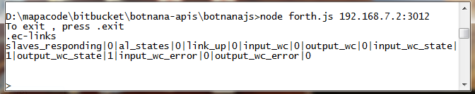
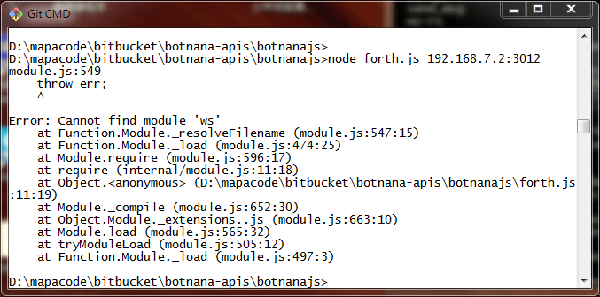

# botnanajs

## 目錄說明：

    botnana-apis
    |-----> botnanajs
            |-----> forth.js  互動式指令介面
            |-----> examples
                    |-----> abort_program.js -- Abort program execution.
                    |-----> empty.js -- Empty user defined programs.
                    |-----> get_all.js - Get information from all slaves
                    |-----> test_invalid - Tests access to invalid slaves and invalid
                    |                      channels not crash botnana control.
                    |-----> test_slave_api.js -- Test Slave API.
                    |-----> test_version_api.js -- Test Version API.
                    |-----> words.js - List all Forth words.

## forth.js:

forth.js 是一個簡單的互動式指令介面，可以將 Forth 命令送到 Botnana-Control，從  Botnana-Control 收到 MTConnect 格式的訊息，其操作畫面如下:

使用前必須先安裝 Node.js，請參考以下網站:

 [https://nodejs.org/en/](https://nodejs.org/en/) 

要運行 forth.js 首先要使用命令列視窗切換到 `botnana-api\botnanajs` 所在目錄，執行以下命令

    node forth.js 192.168.7.2:3012

第一次運行可能會遇到以下錯誤訊息:

    Error: Cannot find module 'ws'

其原因是 forth.js 需要使用 ws 函式庫，只要在 `botnana-api\botnanajs` 所在目錄，執行以下命令就可以安裝完成:

    npm install
